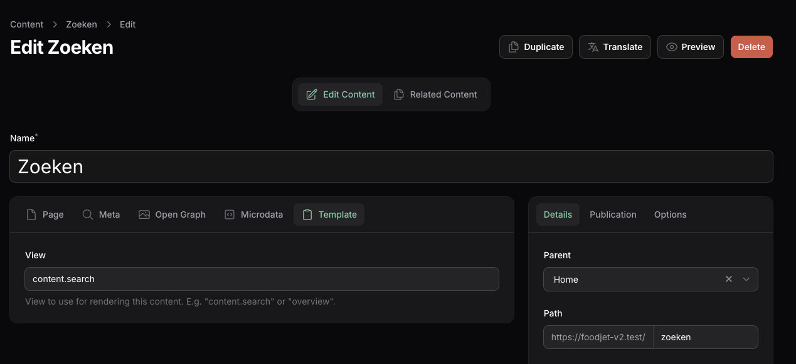

# Content

Content is the foundation of each page. Every content item has a [type](/02-types/01-introduction) defined by configurable [fields](/03-fields/01-introduction).

## Blade

Blade templates are resolved in this order:

1. The `view` value for the content (e.g., `content.sidebar-left`).
2. `/resources/views/types/{content_type}.blade.php` (where `{content_type}` is the type slug).
3. `/resources/views/types/default.blade.php` (fallback for types without a custom template).
4. The Backstage default blade file.

### Variables

- `$content`: Always available, represents the current `Backstage\Models\Content` instance.

### Example

```php
<x-page>
    {{ $content->field('body') }}

    @foreach ($content->field('authors') as $author)
        {{ $author->field('name') }}<br />
    @endforeach

    <x-blocks field="blocks" />
    <x-blocks field="main" />
</x-page>
```

## View Composers

If you want custom code to be executed and control the variables to the view you can use [View Composers](https://laravel.com/docs/12.x/views#view-composers) to achieve this.

1. When editing content, use a custom view for the content (e.g. `content.search`).


2. Create a View Composer

```php
// app/View/Composers/SearchComposer.php

namespace App\View\Composers;

use Backstage\Models\Content;
use Illuminate\Http\Request;
use Illuminate\View\View;

class SearchComposer
{
    /**
     * Create a new profile composer.
     */
    public function __construct(
        public Request $request,
    ) {}

    /**
     * Bind data to the view.
     */
    public function compose(View $view): void
    {
        $params = $this->request->query();

        $results = Content::when($params['q'] ?? null, function ($query, $search) {
            return $query->where('name', 'like', '%' . $search . '%');
        })
            ->public()
            ->orderBy('created_at', 'desc')
            ->paginate(10);

        $view->with('results', $results);
    }
}
```

3. Register this composer in the AppServiceProvider.php

```php
// app/Providers/AppServiceProvider.php

public function boot(): void
{
    View::composer('content.search', SearchComposer::class);
}
```

4. You can now use this in your blade file

```blade
<!-- resources/views/content/search.blade.php -->

<div class="col-span-full py bg-full-orange text-white">
    <strong>Zoeken</strong>
    @dump($results)
</div>

```

## Retrieving Data from Components

To retrieve data from a component, you can use the shared view data:

```php
$content = view()->shared('content');
```

This allows you to access the current content instance from within components or other parts of your application.