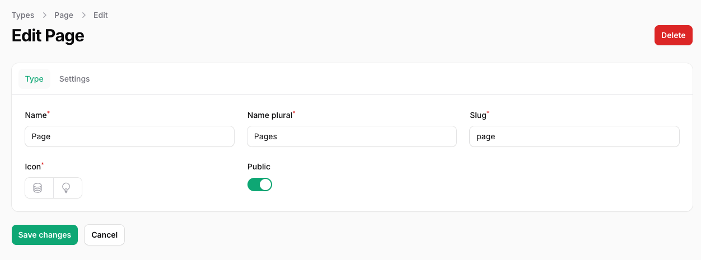
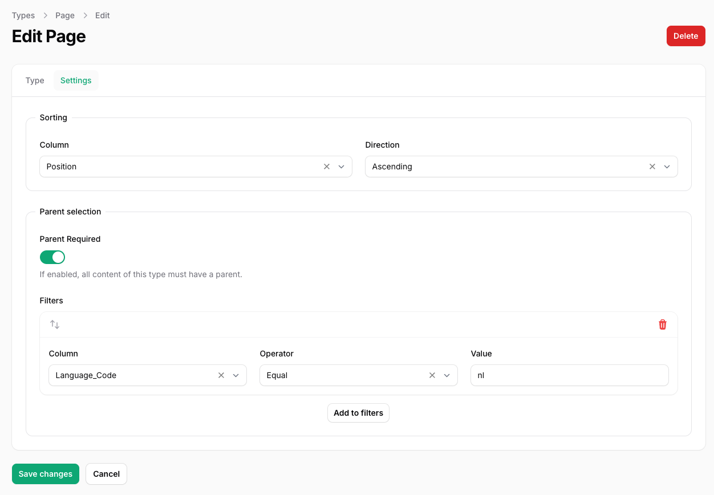
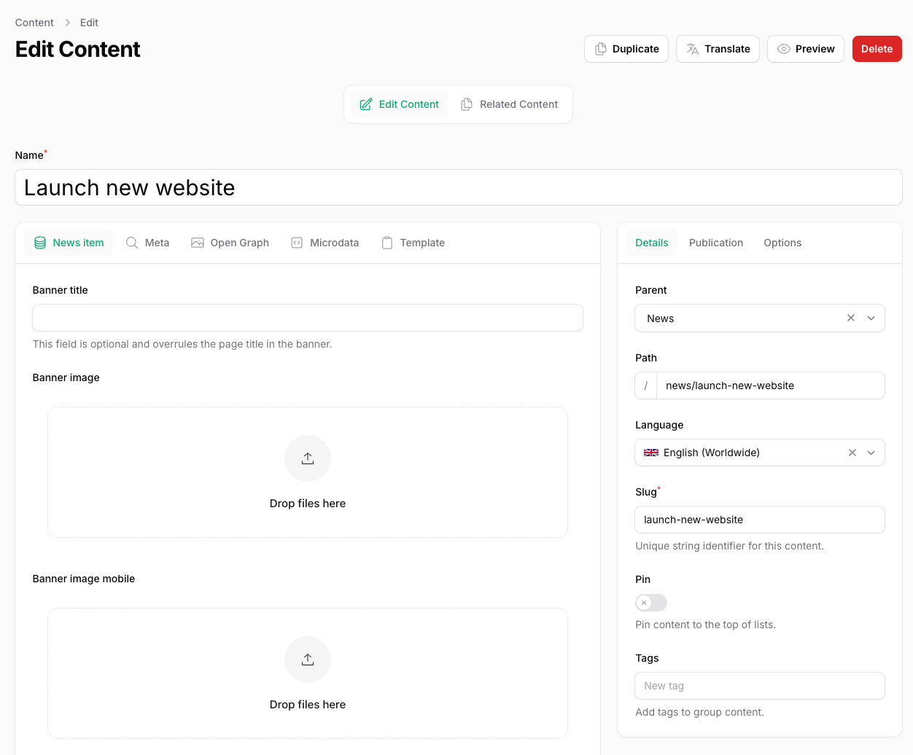

# Types

**Content types** define the structure of the content you create. For example, when creating a page in your CMS, you might want users to fill in fields like:

- **Title**  
- **Body**  
- **Call to Action (CTA)**  
- …and many more.  

You can create content types and add custom fields to them using the built-in [Fields](/03-fields/01-introduction) package.

## Defining a Type

To define a new content type:

1. Enter a **Name** — the system will automatically suggest the plural form and slug, which you can adjust if needed.
2. Choose an **Icon** to visually represent this type.
3. Set the default **Visibility** for content of this type — either **Public** or **Private**.  
   *(Note: This can still be overridden on a per-item basis.)*

## Configuring Settings

### Sorting

You can define how content of this type should be sorted by default. Simply select the column you want to use for sorting in the **Settings** tab.

### Parent Selection

If your content should be organized under a parent, you can enforce this in the **Settings** tab. For example:

Suppose you've created a **News Page**. To structure your news items correctly, you can:

- Create a **News** content type.  
- Require users to select a **Parent** (e.g., the News Page) when adding new content of this type.  

This ensures consistent URLs and a logical content hierarchy.

