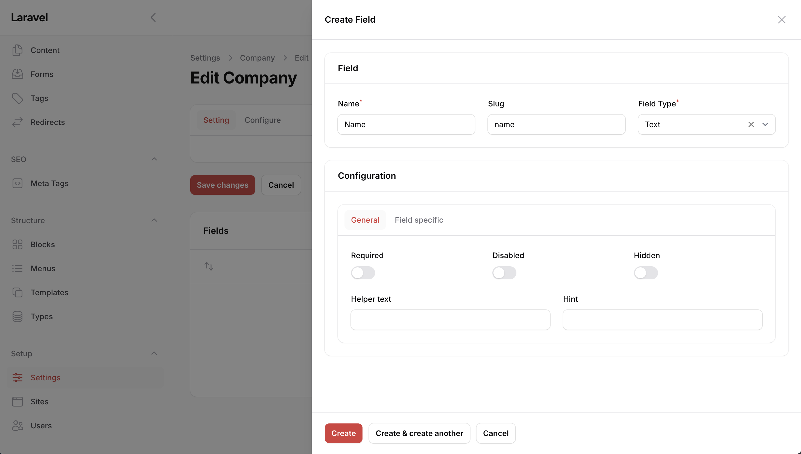
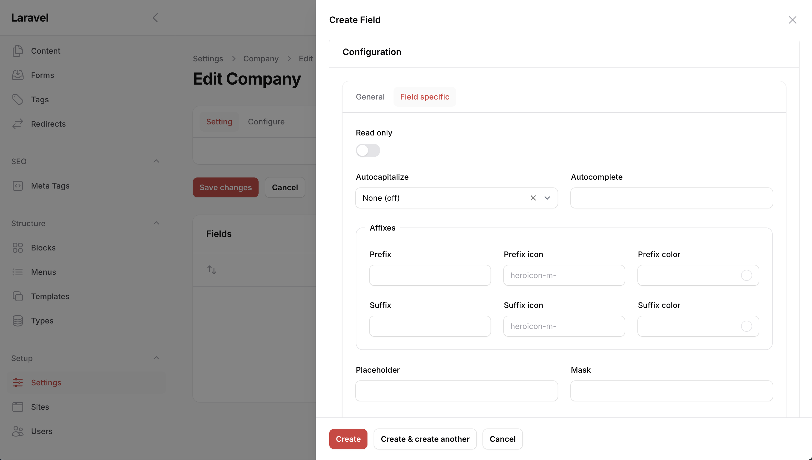

# Fields

Fields are configurable (custom) Filament form fields that can be used in [Content](/01-content/01-introduction), [Forms](/05-forms/01-introduction) and [Settings](/06-settings/01-introduction). We provide a set of fields that can be used out of the box, but you can also create your own fields.



Most of the fields are based on the Filament fields, but we might miss some configuration options. If you need a specific configuration option, you can create your own field or submit a PR to add the configuration option to the field.

## Setup

If you want to have your custom fields available in backstage, register them by adding the fields to `config/backstage.php`.

```php
return [
    // ...

    'fields' => [

    ]
];
```

Then this component should be available in the Settings field relation manager:



To see how to create a field, check the [Creating a field](/03-fields/02-creating-a-field.md) page.
