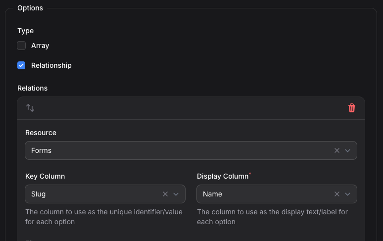
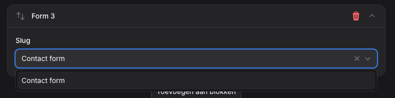

# Forms

Create, manage, and embed forms in your content. Forms support custom fields and actions that run after submission.

## Overview

With Forms you can:
- Create forms with custom fields
- Add forms to content using the content builder
- Handle form submissions with custom actions
- Customize form rendering with Blade templates

## Adding Forms to Content

To add forms to your content, follow these steps:

### 1. Create a Form

Create a new form in the admin panel under Forms. Add your fields, validation rules, and settings.

### 2. Create a Block Component

To use forms in the content builder, create a block component:

#### 2a. Select the Form Component
Go to Components tab and select the **Form Component**.

#### 2b. Add a "slug" Field to the Block
Add a new field with this configuration:
- **Slug**: `slug`
- **Name**: `form` (or any descriptive name you prefer)
- **Type**: Select
- **Field Specific Options**:
  - Select the **Relationship** option
  - Choose **Form Resource** as the related resource
  - Set **slug** as the Key column
  - Set **name** as the Display column



After this setup, forms will be available in the content builder.



## Custom Form Templates

Create custom Blade templates for your forms:

### Template Locations

Create custom form templates in one of these locations:
- `resources/views/components/forms/{slug}.blade.php` (form-specific template)
- `resources/views/components/forms/default.blade.php` (default template for all forms)

### Available Variables

These variables are available in your form templates:

```php
@dump($slug, $form, $content)
```

- `$slug` - The form's unique slug identifier
- `$form` - The complete form object with all fields and settings
- `$content` - The content object where the form is embedded

### Default Template Structure

The default form template:

```html
<div {{ $attributes }}>
    <form method="POST" action="{{ route('backstage.forms.submit', $form->slug) }}" enctype="multipart/form-data">
        @csrf
        <input type="hidden" name="content_ulid" value="{{ $content->ulid }}">
        @foreach ($form->fields as $field)
            <div>
                <label for="{{ $field->slug }}">{{ $field->name }}</label>
                <input type="{{ $field->type }}" name="{{ $field->slug }}" id="{{ $field->slug }}">

                @error($field->slug)
                    <p>{{ $message }}</p>
                @enderror
            </div>
        @endforeach

        <button type="submit">{{ $form->submit_button ?? __('Submit') }}</button>
    </form>
</div>
```

## Direct Form Integration

You can also include forms directly in your Blade templates using the form component:

```blade
<x-form slug="contact" />
```

Replace `contact` with the slug of your desired form.

## Form Actions

Configure actions that execute after form submission:
- Send email notifications
- Redirect to a URL

The URL can use these variables:
- `{submission}` = the encrypted ULID of the submission

Configure actions in the form settings. They run automatically after successful submission.