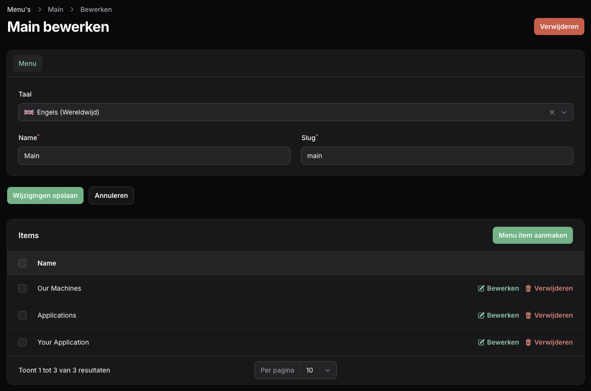
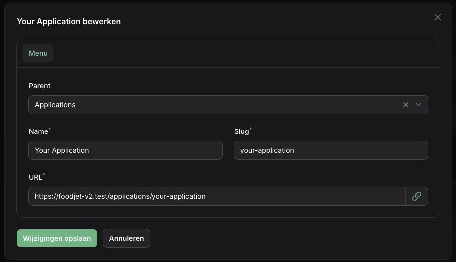

# Menu

A menu is a collection of links in a recursive tree.

## Create menu



Menu and items can be created through the Menu option in the Structure section. When adding items (links) you can choice a parent to make it a subset. There is no limit to how many subsets a menu has.



Items are found in the MenuItem.php model and can be retreived through the [Laravel Adjacency List](https://github.com/staudenmeir/laravel-adjacency-list) functions:

```php
$items = MenuItem::where('menu_slug', 'main')
    ->select(['ulid', 'parent_ulid', 'slug', 'name', 'url'])
    ->get()
    ->toTree()
    ->toArray();
```
