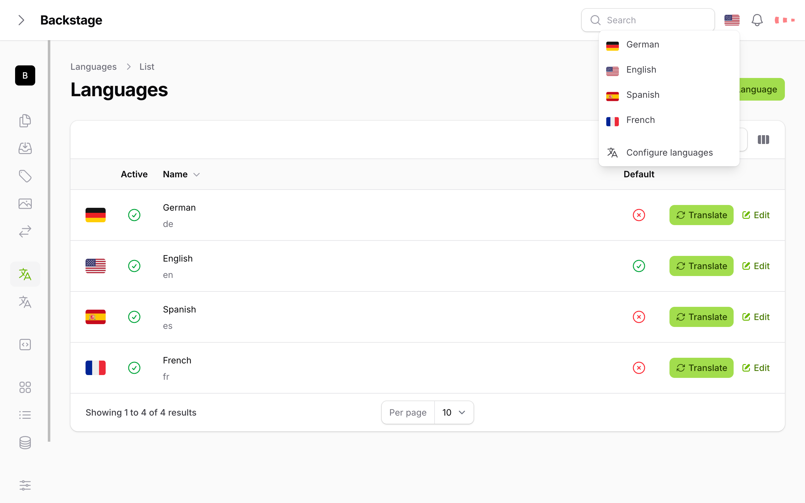
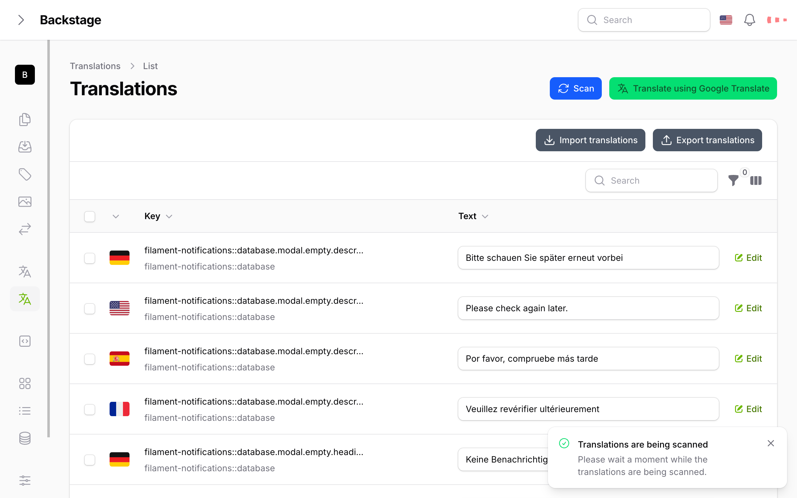

# Backstage Translations for Filament

A Filament admin panel plugin that provides a complete translation management system for Laravel applications.

## What This Package Does

This package extends the [Laravel Translations](../laravel-translations/index.md) package with a beautiful Filament admin interface for managing translations.

### Core Features

- **Language Management**: Add, edit, and manage multiple languages
- **Translation Editor**: Edit translations directly in the admin panel
- **Language Switcher**: Switch between languages in the admin interface
- **Auto-Translation**: Queue translations for automatic processing
- **Import/Export**: Import and export translation files
- **Translation Status**: Track which translations are complete

## What You Can Do

### 1. Manage Languages
- Add new languages with country flags
- Set default languages
- Enable/disable languages
- View translation completion percentages

### 2. Edit Translations
- Edit translation text directly in tables
- View all language versions of a translation
- Bulk edit multiple translations
- Filter by language or translation status

### 3. Language Switching
- Switch languages in the admin panel
- Language switcher shows current language
- Automatic page reload after language change

### 4. Import/Export
- Import translation files
- Export translations for backup
- Support for various file formats

## How It Works

This package builds on top of the Laravel Translations package, which provides:

- **Auto-scanning**: Finds `trans()`, `__()`, `@lang` in your code
- **Multiple providers**: Google Translate, DeepL, AI translation
- **Model attributes**: Translate Eloquent model attributes
- **Performance**: Optional caching and queued operations

## Quick Setup

1. Install the package
2. Publish migrations and config
3. Run migrations
4. Add the plugin to your Filament panel
5. Add languages and start translating

## Requirements

- PHP 8.2+
- Laravel 10.x, 11.x, or 12.x
- Filament 4.0+
- Laravel Translations package

## Documentation

For detailed setup and configuration, see the main [README](../README.md) file.
